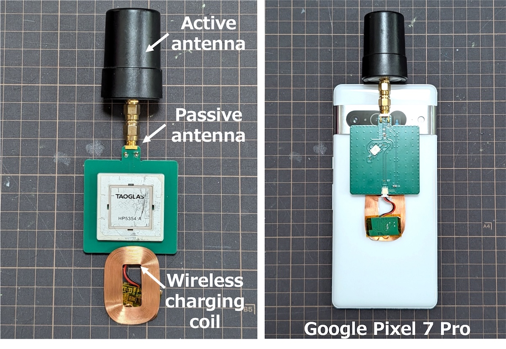
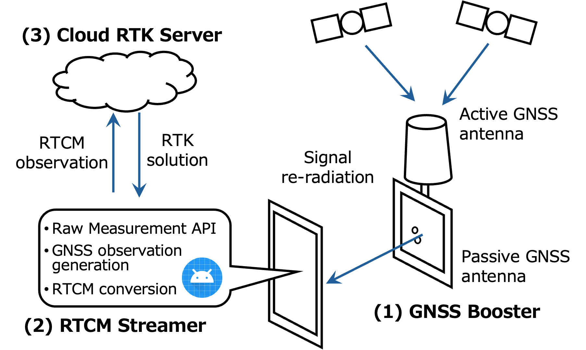

# Smartphone GNSS Booster

Open hardware and software for real-time centimeter-level positioning with an ordinary
Android smartphone.

The GNSS Booster mounted on a Google Pixel 7 Pro. The active antenna is connected to the
SMA input of the booster board. The board is attached to the back of the phone so that its
patch antenna faces the phone's internal GNSS antenna, and it is powered from the phone
through a wireless charging coil.

## Signal quality with and without the booster

https://github.com/user-attachments/assets/fdf9c746-18d8-440e-81c1-8e80b914b0a0

C/N0 of the signals tracked by the phone's built-in receiver, shown in GnssLogger, without
and with the booster.

## Real-time RTK while walking

https://github.com/user-attachments/assets/c614222c-13b6-4745-9687-ba6e5637af83

The RTCM Streamer app streams observations to the cloud RTK server while walking and
displays the returned centimeter-level RTK solution (`FIX`) in real time.

## How it works

Smartphones use small, linearly polarized GNSS antennas. The resulting raw measurements are
so noisy that RTK cannot reliably resolve the carrier-phase integer ambiguities. This project
addresses the problem from two sides:

1. **gnss-booster** – a small board mounted on the phone. It takes the signal from an
   external active GNSS antenna and re-radiates it into the phone's internal antenna
   through an L1/L5 patch antenna. This greatly improves the signal strength and the
   measurement quality of the phone's built-in GNSS receiver.
2. **android-rtcm-streamer** – an Android app that reads the phone's raw GNSS
   measurements, converts them to RTCM3 MSM observations and streams them to an RTK
   server. The server's position solution is streamed back and displayed on the phone.

A cloud RTK server running `rtkrcv` from [rtklibexplorer's RTKLIB](https://github.com/rtklibexplorer/RTKLIB)
completes the system. The server is not part of this repository; the app's README shows the
`rtkrcv` configuration it expects.

## System overview

(1) The GNSS Booster receives the satellite signals with an external active antenna and
re-radiates them into the phone. (2) The RTCM Streamer app reads the raw measurements,
converts them to RTCM observations and sends them to (3) a cloud RTK server, which returns
the RTK solution to the phone.

## Contents

| Directory | What it is |
|---|---|
| [`gnss-booster/`](gnss-booster/) | KiCad 10 project of the re-radiator board: schematic, layout, project libraries, Gerbers, BOM with LCSC part numbers, placement files |
| [`android-rtcm-streamer/`](android-rtcm-streamer/) | Android app (Kotlin + RTKLIB via JNI): raw measurements to RTCM3 MSM7, TCP uplink/downlink, RINEX and GnssLogger-compatible logging |

Each directory has its own README with build, fabrication and usage instructions.

## Status

- Tested with a Google Pixel 7 Pro (Android 16).
- The board re-radiates GNSS signals. Depending on your country, operating a GNSS
  re-radiator may require a license or may be restricted to shielded environments.
  Check your local radio regulations before use.

## License

MIT License, see [`LICENSE`](LICENSE). The app bundles parts of
[RTKLIB](https://github.com/rtklibexplorer/RTKLIB) (BSD 2-Clause), see
[`android-rtcm-streamer/app/src/main/cpp/rtklib/LICENSE.txt`](android-rtcm-streamer/app/src/main/cpp/rtklib/LICENSE.txt).

## Publications

If you use this project in your research, please cite one of the following papers.

- Taro Suzuki, "Smartphone GNSS Booster: Centimeter-Level Pedestrian Positioning Using a
  Portable Signal Re-Radiator," *Proceedings of the ION 2026 Pacific PNT Meeting*,
  Honolulu, Hawaii, April 2026, pp. 512–524.
- Taro Suzuki, "Smartphone GNSS Booster for Real-Time Centimeter-Level Kinematic
  Positioning: An Open Hardware and Software Approach," *Proceedings of the ION GNSS+ 2026*.

## Acknowledgements

[Takuho Munetomo](https://github.com/takuhoTech) contributed to the design of the GNSS
booster board.
