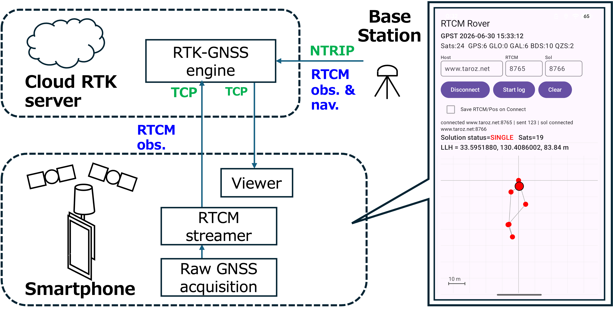

# RTCM Streamer

Android app that turns a smartphone into an RTK rover input for [RTKLIB](https://github.com/rtklibexplorer/RTKLIB) `rtkrcv`.

It reads raw GNSS measurements (Android `GnssMeasurement` API), converts them to
pseudorange / carrier phase / Doppler / SNR, encodes RTCM3 MSM7 messages
(GPS, GLONASS, Galileo, BeiDou, QZSS; L1 + L5) and streams them over TCP to a
server running `rtkrcv`. The position solution returned by `rtkrcv` is received
over a second TCP connection and shown on screen.

Tested device: Google Pixel 7 Pro (Android 16). Other Pixel models with a
dual-frequency Broadcom GNSS chip (Pixel 6 / 8 / 9 Pro class) are expected to
work. The native library is built for `arm64-v8a` only, and the minimum Android
version is 8.0 (API 26).



Left: data flow. The phone acquires raw GNSS measurements, encodes them as RTCM
observations and sends them over TCP to the RTK-GNSS engine (`rtkrcv`) on the cloud
server, which also receives base station observations and navigation data over NTRIP.
The solution is sent back over a second TCP connection and shown in the viewer.
Right: the app screen with connection settings, status line, solution and a plot of the
recent positions.

## Build and install from source

### Prerequisites

- [Android Studio](https://developer.android.com/studio) (a recent version; the
  project uses Android Gradle Plugin 9.2 and Gradle 9.5)
- From the SDK Manager, install:
  - Android SDK Platform 36 and platform-tools (adb)
  - NDK (r26 or newer) and CMake 4.1.2 (SDK Tools tab; the CMake version is
    pinned in `app/build.gradle.kts`)
  - Google USB Driver (Windows only)
- A phone with USB debugging enabled
  (Settings > About phone > tap "Build number" 7 times, then
  Settings > System > Developer options > USB debugging)

### Steps

1. Clone the repository and open the app folder in Android Studio:

   ```sh
   git clone https://github.com/taroz/Smartphone-GNSS-Booster.git
   ```

   In Android Studio choose **File > Open** and select the
   `Smartphone-GNSS-Booster/android-rtcm-streamer` folder (the one containing
   `settings.gradle.kts`). Accept any prompts to install missing SDK / NDK
   components.

2. Connect the phone by USB and accept the "Allow USB debugging" dialog on the phone.

3. Select the phone in the device dropdown and press **Run** (green triangle).
   The first build compiles the bundled RTKLIB C sources with the NDK, so it
   takes a few minutes.

Alternatively, from a terminal inside `android-rtcm-streamer`:

```sh
./gradlew :app:installDebug        # Linux / macOS
gradlew.bat :app:installDebug      # Windows
```

If Gradle cannot find the SDK, create `local.properties` with
`sdk.dir=<path to your Android SDK>` (use forward slashes on Windows).

The pure-Kotlin parts (observable conversion, signal-code mapping, `.pos` parsing,
coordinate conversion) have JVM unit tests under `app/src/test`:

```sh
./gradlew :app:testDebugUnitTest
```

## Using the app

1. Start the app and grant the **precise location** permission. Satellite
   counts per constellation and GPS time appear once measurements arrive
   (go outdoors with a clear sky view).
2. Enter the server **Host**, the **RTCM** port (rover input to `rtkrcv`) and
   the **Sol** port (solution output from `rtkrcv`). Defaults are
   `127.0.0.1`, `8765`, `8766`. Settings are remembered.
3. Press **Connect**. RTCM3 is streamed at 1 Hz and the received solution is
   plotted as an East-North track (colored by fix quality). **Clear** resets the track.
4. **Start log / Stop log** records the raw measurements (CSV, GnssLogger
   compatible) and a RINEX observation file independently of the connection.
   Check **Save RTCM/Pos on Connect** to also keep the sent RTCM3 and received
   `.pos` files. Files are offered via the Android share sheet when logging or
   the connection stops.

## Server side (rtkrcv)

The app does not include a server. Run `rtkrcv` from
[rtklibexplorer's RTKLIB](https://github.com/rtklibexplorer/RTKLIB) with the phone
as rover input and the solution as output, both as TCP servers, e.g. in `rtkrcv.conf`:

```
inpstr1-type       =tcpsvr     # rover: the phone connects here
inpstr1-path       =:8765
inpstr1-format     =rtcm3
inpstr2-type       =ntripcli   # base station corrections
inpstr2-path       =user:pass@caster:2101/MOUNTPOINT
inpstr2-format     =rtcm3
inpstr3-type       =ntripcli   # ephemeris (the phone sends observations only)
inpstr3-path       =user:pass@caster:2101/EPHEMERIS_MOUNTPOINT
inpstr3-format     =rtcm3
outstr1-type       =tcpsvr     # solution: the phone connects here
outstr1-path       =:8766
outstr1-format     =llh
```

Because the phone opens both connections outbound, this works from a mobile
network behind carrier NAT. For a quick local test with the phone on USB,
run `rtkrcv` on your PC and forward the ports:

```sh
adb reverse tcp:8765 tcp:8765
adb reverse tcp:8766 tcp:8766
```

then use `127.0.0.1` as Host in the app.

## Notes

- The app sends observations only. `rtkrcv` needs broadcast ephemeris from another
  source, e.g. an NTRIP mount point as in the configuration above.
- Raw GNSS measurements and RTCM output are only as good as the phone's GNSS
  chip. A clear sky view matters most; the [gnss-booster](../gnss-booster) board
  improves the measurement quality considerably.
- On Android 12 (API 31) and newer the app requests full GNSS tracking, which
  disables duty cycling and is required for stable L5 measurements.
- Logged files are stored under the app's external files directory
  (`Android/data/org.furo.rtcmstreamer/files/`) in `gnsslog/`, `rinex/`,
  `rtcm/` and `pos/`.

## License and acknowledgements

- This app is released under the MIT License (see the repository root
  [`LICENSE`](../LICENSE)).
- The RTCM3 encoder and RINEX writer are taken from RTKLIB (demo5) by
  T. Takasu and rtklibexplorer, BSD 2-Clause License. See
  [`app/src/main/cpp/rtklib/LICENSE.txt`](app/src/main/cpp/rtklib/LICENSE.txt).
