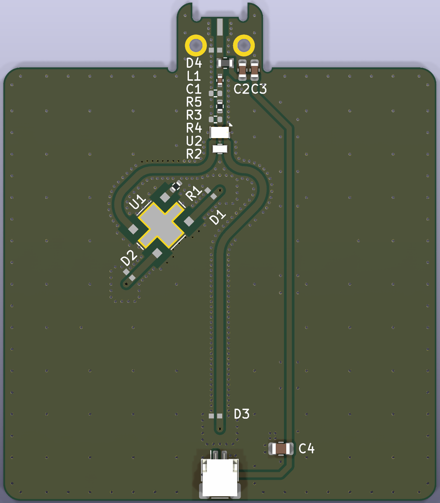
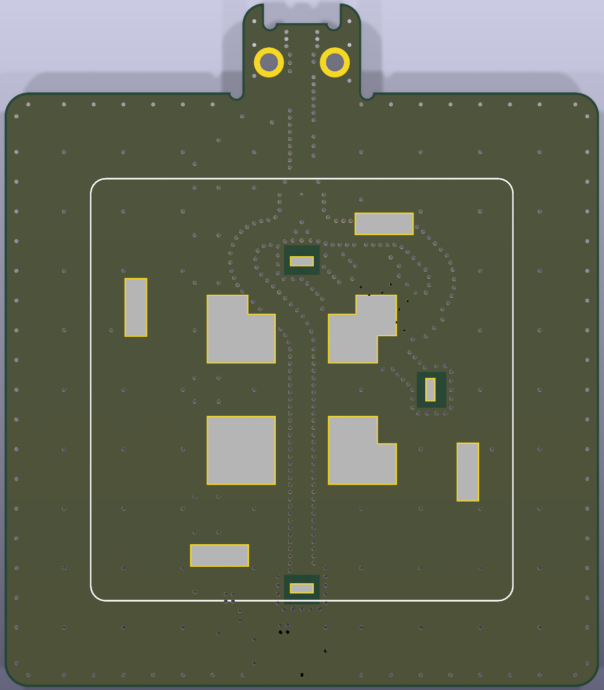

# GNSS Booster

Smartphone-mounted GNSS signal re-radiator, designed in [KiCad](https://www.kicad.org/) 10.

An external active GNSS antenna (with its own LNA, powered through the coax by this
board) is connected to the SMA input. The board splits the signal into L1 and L5 paths
and feeds a dual-band patch antenna on the back side, which re-radiates the signal into
the smartphone's internal GNSS antenna. The phone therefore receives a much cleaner
signal than it would with its own antenna alone, which is what makes RTK with the
[android-rtcm-streamer](../android-rtcm-streamer) app practical.

Left: the parts of the booster. Right: mounted on the back of a Google Pixel 7 Pro, with
the patch antenna facing the phone's internal GNSS antenna. The wireless charging coil
supplies the +3.3 V for the board and the active antenna. A demonstration of the signal
improvement is shown in the [top-level README](../README.md#demonstration).

| Top (components) | Bottom (patch antenna) |
|---|---|
|  |  |

- Schematic: [docs/gnss-booster-schematic.pdf](docs/gnss-booster-schematic.pdf)
- Layout overview: [docs/gnss-booster-layout.svg](docs/gnss-booster-layout.svg)

## Circuit

Signal path, from the SMA input `J1` to the patch antenna `AE1`:

1. **Bias tee** – the inductor `L1` (120 nH) injects +3.3 V from `J2` onto the coax to
   power the external antenna's LNA; `C1` (47 pF) blocks the DC from the RF path.
   `C2`/`C3`/`C4` decouple the supply.
2. **Attenuator** – `R3`/`R4`/`R5` (37 Ω series, 150 Ω shunts) form a ~6 dB π attenuator
   that sets the re-radiated level and improves the match seen by the divider.
3. **Power divider** – `U2` (TTM Xinger PD0922J5050S2HF, 0.95–2.15 GHz Wilkinson)
   splits the signal into an L1 and an L5 branch. `R2` (100 Ω) is the divider's
   isolation resistor.
4. **L1 branch** – `U1` (TTM Xinger X3C14P1-03S, 1.2–1.7 GHz 3 dB 90° hybrid) drives the
   two orthogonal L1 feed points of the patch in quadrature to produce circular
   polarization. `R1` (50 Ω) terminates the hybrid's isolated port.
5. **L5 branch** – connected directly to the patch's L5 feed point.
6. **ESD protection** – `D1`–`D4` (Littelfuse AXGD10402KR) on the SMA input and on each
   antenna feed.

The patch antenna (Taoglas HP5354.A, 35 × 35 mm, L1 + L5) is mounted on the bottom
side, so the top side with the components faces away from the phone.

## Board

| Item | Value |
|---|---|
| Size | 50 × 57.5 mm (50 × 50 mm body plus the SMA tab) |
| Layers | 2 (F.Cu / B.Cu), FR-4 core 0.71 mm, total 0.8 mm |
| Surface finish | ENIG |
| Min. track / clearance | 0.1 mm / 0.1 mm |
| Min. via | 0.41 mm diameter, 0.2 mm drill |

Fabrication and assembly files exported for JLCPCB with the *Fabrication Toolkit*
plugin are in [`production/`](production/):

- `gnss-booster.zip` – Gerbers and drill files
- `bom.csv` – BOM with LCSC part numbers (the `R4`/`R5` 150 Ω 0402 resistors have no
  LCSC number; any 1 % 0402 part works)
- `positions.csv` – component placement (CPL)
- `netlist.ipc` – IPC-D-356 netlist
- `designators.csv` – reference designators

## Bill of materials

| Ref | Part | Package | Function | LCSC |
|---|---|---|---|---|
| AE1 | Taoglas HP5354.A | 35 × 35 mm patch | L1/L5 re-radiating patch antenna (bottom side) | C30042276 |
| U1 | TTM Xinger X3C14P1-03S-1 | 6.35 × 5.08 mm | 3 dB 90° hybrid coupler, L1 quadrature feed | C36369905 |
| U2 | TTM Xinger PD0922J5050S2HF | 0805 (6-pad) | Wilkinson power divider, L1/L5 split | C5136968 |
| R1 | Vishay FCHP0402E50R0BGT1, 50 Ω | 0402 | Hybrid isolated-port termination | C4267592 |
| R2 | Vishay FC0603E1000BTBST1, 100 Ω | 0603 | Divider isolation resistor | C2076508 |
| R3 | 37 Ω | 0402 | π attenuator, series | C17168 |
| R4, R5 | 150 Ω | 0402 | π attenuator, shunt | – |
| C1 | Murata GJM1555C1H470FB01D, 47 pF | 0402 | DC block | C882562 |
| C2 | 0.1 µF | 0603 | Supply decoupling | C14663 |
| C3 | 1 µF | 0603 | Supply decoupling | C15849 |
| C4 | 10 µF | 0805 | Supply decoupling | C440198 |
| L1 | Murata LQW18ANR12G80D, 120 nH | 0603 | Bias-tee inductor | C307612 |
| D1–D4 | Littelfuse AXGD10402KR | 0402 | ESD protection | C434715 |
| J1 | Molex 73251-2440 | SMA female, edge mount | RF input from the external antenna | C588468 |
| J2 | JST SM02B-SRSS-TB | SH 1.0 mm, 2 pin | +3.3 V power input | C160402 |

## Opening the project

Open `gnss-booster.kicad_pro` in KiCad 10 (or newer). The project is self-contained:

- Symbols and footprints that are not in the KiCad standard library (antenna, coupler,
  divider, SMA connector, and the specific passive footprints) live in
  [`libs/gnss-booster.kicad_sym`](libs/gnss-booster.kicad_sym) and
  [`libs/gnss-booster.pretty`](libs/gnss-booster.pretty), referenced through the
  project-local `sym-lib-table` / `fp-lib-table` as library `gnss-booster`.
- Everything else comes from the standard libraries shipped with KiCad.
- 3D models for the project-library parts live under `libs/3d/`. STEP files are
  included for the Xinger power divider and the Vishay 0603 resistor; the models for the
  patch antenna, the hybrid coupler and the SMA connector are vendor files that are not
  redistributed here. Missing models only affect the 3D viewer.

Design checks (`kicad-cli sch erc` / `kicad-cli pcb drc`) report only intentional
items: the +3.3 V and GND nets have no `PWR_FLAG` (they are driven by the `J2`
connector), the antenna feed vias sit inside the antenna keepout on purpose, and a few
courtyards overlap in the dense area around the SMA connector.

## Regulatory note

This board re-radiates GNSS signals. Depending on your country, operating a GNSS
re-radiator may require a license or may be restricted to shielded environments.
Check your local radio regulations before use.

## License

Copyright (c) 2026 Taro Suzuki.

This hardware design (schematic, layout, libraries, fabrication outputs and this
documentation) is licensed under the CERN Open Hardware Licence Version 2 - Permissive
(CERN-OHL-P-2.0). You may redistribute and modify it under the terms of that licence,
see [`LICENSE`](LICENSE) or <https://ohwr.org/cern_ohl_p_v2.txt>. It is distributed
WITHOUT ANY EXPRESS OR IMPLIED WARRANTY, including of merchantability, satisfactory
quality and fitness for a particular purpose.

The Android app in [`android-rtcm-streamer/`](../android-rtcm-streamer) is licensed
separately under the MIT License (see the repository root [`LICENSE`](../LICENSE)).
Component datasheets and 3D models are the property of their respective manufacturers.

## Acknowledgements

[Takuho Munetomo](https://github.com/takuhoTech) contributed to the design of this board.
